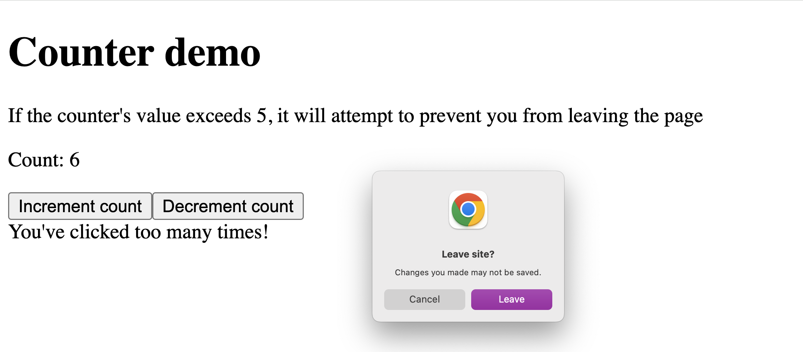

# React Router v6 useBlocker App-Wide Exploration

This repo demonstrates how you can have an app-wide usage of `useBlocker` to prevent navigation away from the page when there are unsaved changes.

